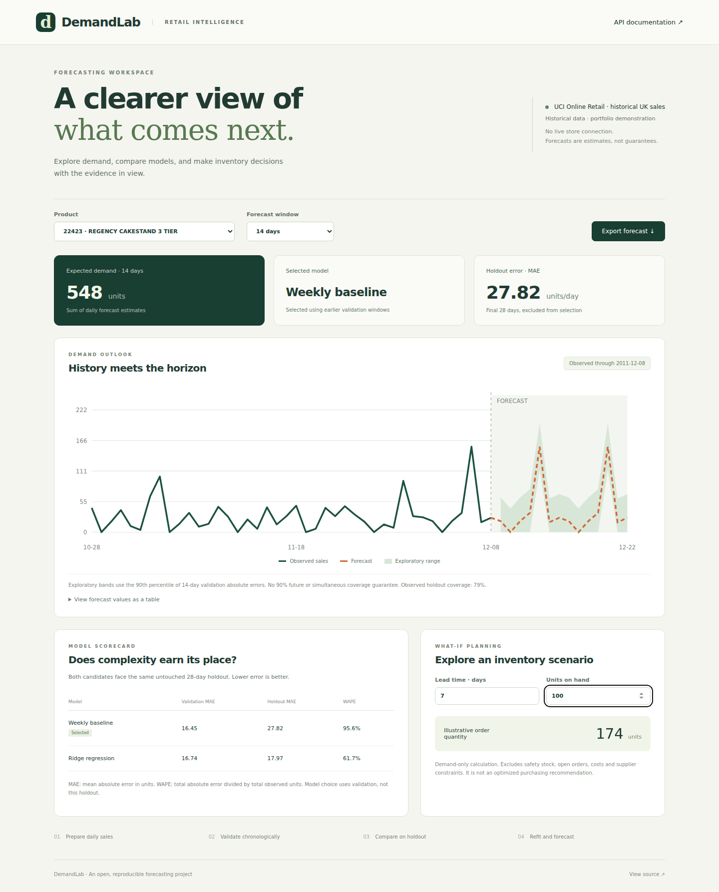

# DemandLab — Demand Forecasting & Inventory Explorer

A full-stack forecasting application with **chronological evaluation, a FastAPI backend and a responsive React interface**. It compares a weekly baseline against Ridge regression, keeps the final 28 days out of model selection, and exposes both successes and failure cases.



[Data engineering companion](https://github.com/SJ-14-SJ/retail-data-platform) · [Evaluation report](docs/EVALUATION.md) · [Model card](docs/MODEL-CARD.md)

## What is implemented

- Three real product series derived from UCI Online Retail: 373 daily observations each, 1,119 total.
- A weekly seasonal-naive baseline and recursive Ridge forecasts using lag, rolling, calendar and trend features.
- Four expanding 14-day validation windows; per-product model selection by validation MAE.
- A separate 28-day holdout and explicit error/coverage reporting.
- Refit on the available history for the next 28 forecast days.
- A versioned JSON artifact containing history summaries, metrics, fold dates, predictions and Ridge parameters where applicable.
- A FastAPI service with documented endpoints, input validation and explicit missing-artifact errors.
- React controls for product and horizon selection, an accessible forecast table, downloadable CSV, responsive charts and inventory scenarios.
- Python and browser regression tests plus GitHub Actions.

The API serves the precomputed versioned forecast. Retraining is an explicit command; this is not an online-learning service.

## Run locally

Use Python 3.12 and Node.js 22+. From the repository root:

```bash
python -m venv .venv
# macOS / Linux
source .venv/bin/activate
# Windows PowerShell: .venv\Scripts\Activate.ps1
python -m pip install -r requirements.txt
python -m forecast.train
npm --prefix frontend ci
npm --prefix frontend run build
python -m uvicorn forecast.api:app --port 8000
```

Open **http://localhost:8000** for the application and **http://localhost:8000/docs** for API documentation. The application uses the bundled aggregate CSV and requires no account, API key or external model service.

For frontend development, keep the API running and run `npm --prefix frontend run dev`; Vite proxies `/api` to the local Python service.

## Reproduce evaluation

```bash
python -m forecast.train
python -m unittest discover -s tests -v
```

The default CSV is attributed public data. `data/synthetic_demand.csv` is an additional clearly labelled fixture from the companion pipeline; it is not used for the published real-data metrics. To try it independently:

```bash
python -m forecast.train --input data/synthetic_demand.csv --output artifacts/synthetic.json --origin 'Synthetic demonstration'
```

Inspect [data/provenance.json](data/provenance.json) for product selection rules, source checksum and coverage. The full transaction file and customer IDs are not included.

## Browser tests

With the Python virtual environment activated, train the artifact and build the frontend, then run:

```bash
cd frontend
npx playwright install chromium
npm run test:e2e
```

The tests launch a local API if needed and verify horizon controls, inventory inputs, CSV download, mobile overflow and a visible retry state on API failure. Screenshots are written to `docs/`. Linux CI installs browser system dependencies as well.

## API examples

| Endpoint | Purpose |
| --- | --- |
| `GET /api/health` | Artifact readiness, product count and source checksum |
| `GET /api/catalog` | Available products, descriptions and data origin |
| `GET /api/forecast/85099B?horizon=14` | Forecast, history and evaluation for a product |
| `GET /api/inventory/85099B?lead_days=7&on_hand=100` | Illustrative demand-only order quantity |

Horizons and lead times are 1–28 days. The service is read-only and has no authentication or rate limiting; add those before exposing it as a multiuser production service.

## Use the data platform output

Copy the companion platform's `outputs/daily_demand.csv` to a new input path and run `python -m forecast.train --input path/to/file.csv --origin 'Your documented source'`. The contract is one row per `sku,date`, nonnegative `units`, at least 180 consecutive daily observations per product. Missing dates and duplicate keys fail validation rather than being silently repaired.

## Docker

```bash
docker build -t demandlab .
docker run --rm -p 127.0.0.1:8000:8000 demandlab
```

The image builds the UI and model artifact, then runs as an unprivileged user. Docker is optional; the native Python/Node path and automated tests are the verified workflow.

## What the results do and do not show

The validation procedure selected the weekly baseline for products 22423 and 85123A, and Ridge for 85099B. Holdout errors remain high, and selection did not choose the hindsight-best holdout model for every product. See the report for exact results.

The shaded band uses the 90th percentile of absolute errors on 14-day validation folds. It is an **exploratory error band**, not a calibrated guarantee of 90% coverage over a 28-day horizon. Holdout coverage is displayed.

Inventory output is `max(0, ceil(forecast demand over lead time - units on hand))`. It excludes safety stock, costs, supplier constraints and open orders. No reduction in stockouts or inventory costs is claimed.

## Data and attribution

Derived from **Chen, D. (2015). Online Retail. UCI Machine Learning Repository.** [DOI: 10.24432/C5BW33](https://doi.org/10.24432/C5BW33). The source and aggregate derivative are **CC BY 4.0**. We filtered UK transactions, selected three products using only the first 120 days, excluded the last partial day, excluded cancellation rows from gross sales and aggregated to daily units. Zero-filled dates assume complete transaction capture; gross sales are not net demand after returns.

This is historical data from 2010–2011. Forecast dates follow that historical range and are not current retail predictions.

Code is MIT-licensed. Built with Codex assistance; [development exercises](docs/NEXT-STEPS.md) identify work to understand and extend.
